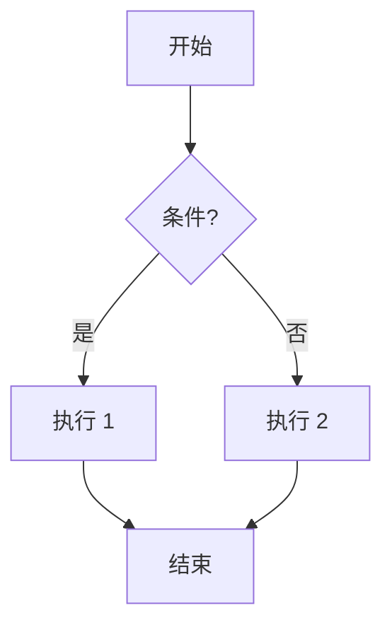

# 一级标题
## 二级标题
### 三级标题
#### 四级标题

---

## 段落 / 换行
这是一个普通段落。  
这是一个带手动换行的段落（上行末尾有两个空格）。

---

## 字体样式
**粗体**  
*斜体*  
***粗斜体***  
~~删除线~~  
`行内代码`  

---

## 列表
### 无序列表
- 苹果
- 香蕉
- 葡萄

### 有序列表
1. 第一项
2. 第二项
3. 第三项

### 任务列表
- [x] 已完成  
- [ ] 未完成  
- [ ] 再来一个  

---

## 引用
> 这是一个引用段落  
> 可以多行  
>> 也可以嵌套引用

---

## 代码块

```js
function hello() {
  console.log("Hello Markdown!");
}
```

```python
import math
print(math.pi)
```

---

## 表格

| 名称 | 数值  | 备注        |
| -- | --- | --------- |
| A  | 123 | 测试        |
| B  | 456 | **粗体也可以** |
| C  | 789 | *斜体也OK*   |

---

## 图片


---

## 超链接

[访问 OpenAI](https://openai.com)
[https://example.com](https://example.com)

---

## 折叠内容（details）

<details>
<summary>点击展开 / 折叠</summary>

这是折叠内部的内容。

* 支持列表
* 支持图片
* 支持代码块

```json
{ "msg": "hello" }
```

</details>

---

## 脚注示例

Markdown 可以添加脚注[^1]，写起来很方便。

[^1]: 这是脚注的内容。

---

## Mermaid 图示例



---

## 数学公式（MathJax）

行内： $E = mc^2$
块级：

$$
\int_0^\infty x^2 e^{-x} , dx = 2
$$

---

## 水平分割线

---


